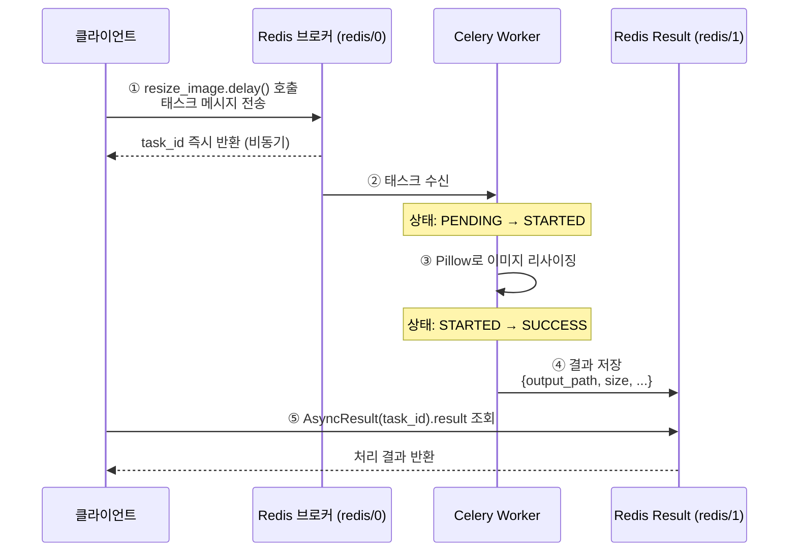

# celery-image-processing-practice

Redis를 브로커로 사용해 이미지 리사이징을 Celery 백그라운드 태스크로 처리하는 실습 프로젝트

---

## Celery 구성 요소

Celery 태스크 작업은 세 가지 역할로 구성된다.

| 역할 | 설명 | 이 프로젝트에서 |
|------|------|----------------|
| **Producer** | 작업을 요청하는 곳 | `run_task.py` (Python 스크립트) |
| **Broker** | 작업을 전달하는 우체통 | Redis (`redis://localhost:6379/0`) |
| **Worker** | 실제로 작업을 수행 | Celery Worker (`celery_app.worker`) |

> Producer가 태스크를 Broker에 던지면, Worker가 Broker에서 꺼내 처리한다.  
> 태스크 결과는 별도 Result Backend(`redis://localhost:6379/1`)에 저장된다.

---

## 파일 구조

```
celery-image-processing-practice/
│
├── celery_app/                  # Celery 앱 패키지
│   ├── __init__.py
│   ├── worker.py                # Celery 인스턴스 생성 및 태스크 모듈 등록
│   └── config.py                # Broker URL, Result Backend, 직렬화 등 설정
│
├── tasks/                       # Celery 태스크 모음
│   ├── __init__.py
│   └── image_tasks.py           # resize_image 태스크 (Pillow 기반 이미지 리사이징)
│
├── images/
│   ├── input/                   # 원본 이미지 입력 경로
│   │   └── example.jpg
│   └── output/                  # 리사이징 결과 이미지 저장 경로 (자동 생성)
│
├── run_task.py                  # 태스크 전송 및 결과 폴링 실행 스크립트 (Producer)
├── docker-compose.yml           # Redis 컨테이너 설정
├── requirements.txt             # 의존성 패키지 목록
└── README.md
```

---

## 시퀀스 다이어그램



---

## 실행 방법

### 사전 준비

```bash
# 가상환경 생성 및 활성화
python -m venv .venv
source .venv/bin/activate

# 의존성 설치
pip install -r requirements.txt
```

### 1단계 — Redis 실행 (Docker)

```bash
docker-compose up -d
```

### 2단계 — Celery Worker 실행 (터미널 1)

```bash
celery -A celery_app.worker worker --loglevel=info
```

Worker가 정상적으로 뜨면 아래와 같이 태스크가 등록된 것을 확인할 수 있다.

```
[tasks]
  . tasks.resize_image
```

### 3단계 — 태스크 실행 (터미널 2)

```bash
python run_task.py
```

#### 실행 결과 예시

```
=================================================
태스크 전송 중 ...
* 입력 파일: images/input/example.jpg
* 목표 크기: 800x600
=================================================
태스크 전송 완료
* Task Id: ee992a95-721b-4825-a3b2-73e608a6b66f
=================================================
결과 대기중 ...
[1/10] 상태: PENDING
[2/10] 상태: SUCCESS
=================================================
!!! 처리 완료 !!!
* 원본 파일: images/input/example.jpg
* 출력 파일: images/output/example_800x600.jpg
* 원본 크기: {'width': 1920, 'height': 1280}
* 변환 크기: {'width': 800, 'height': 600}
* resized 파일 크기(KB): 94.75
```
